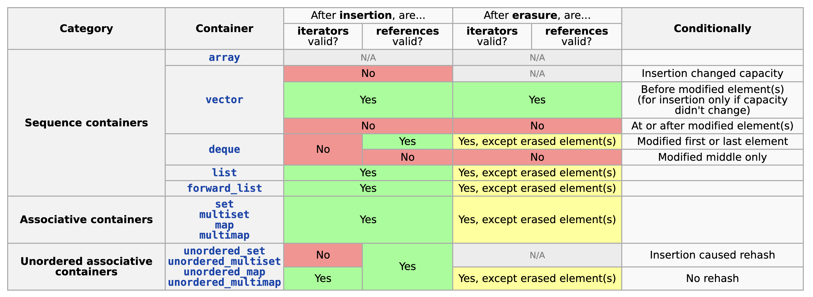
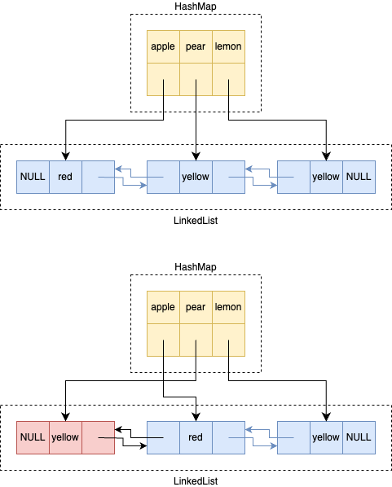

+++
title = 'Design safe collection API with compile-time reference stability in Rust'
date = 2024-02-08T10:00:00+08:00
+++

Reference Stability is an important concept in C++ STL containers, and it is also one of the major sources of Undefined Behavior (UB). Will an iterator or a reference (pointer) keep valid when you do a modification? In C++ STL, the concept only exists on the document, we can find a table [here][cpp_reference_iterator_invalidation]:



The table describes the reference invalidation behavior of containers. E.g., your held reference to a `list` is always valid when you insert new elements to it. However, this is not the case with `deque`. You can understand the behavior if you're familiar with the underlying data structure, but this is not the focus of the post, so we only need to remember the conclusion.

The behavior is both powerful and dangerous. You can always write such code:

```c++
  list<int> container;
  auto& ref1 = container.emplace_back(1);
  auto& ref2 = container.emplace_back(2);
  auto& ref3 = container.emplace_back(3);
  auto it = container.begin();
  ++it;
  container.insert(it, 4);
  cout << ref1 << ref2 << ref3 << endl;
```

As expected, the output is `123`. The insertion doesn't invalidate the held references. But if we choose declare `container` as `deque<int>`, we can only get `423` as output. If we held a reference of `vector`, and visit it after `push`, things will be much worse, the program will output arbitrary number of even cause a segment fault.

```c++
  vector<int> v;
  auto& ref1 = v.emplace_back(1);
  cout << ref1 << endl; // 1
  v.reserve(10000);
  cout << ref1 << endl; // 15420 is output in my environment
```

The Rust language, a new moderm system programming language, guarentee that all undefined behaviors should be eliminated unless explicit `unsafe` code is used. Rust offers an ownership and borrowing mechanism: a value can either be immutably borrowed any times, or be mutually borrowed one time. The code above can't pass compilation in Rust:

```rust
let mut v = vec![];
v.push(1);
let r1 = &v[0];
v.reserve(10000);
println!("{}", r1);
```

```plain
error[E0502]: cannot borrow `v` as mutable because it is also borrowed as immutable
 --> src/main.rs:5:5
  |
4 |     let r1 = &v[0];
  |               - immutable borrow occurs here
5 |     v.reserve(10000);
  |     ^^^^^^^^^^^^^^^^ mutable borrow occurs here
6 |     println!("{}", r1);
  |                    -- immutable borrow later used here

For more information about this error, try `rustc --explain E0502`.
```

`Vec::reserve` is declared as `pub fn reserve(&mut self, additional: usize)`, which receive `&mut self`. By the borrowing mechnism, the value `v` can only be borrowed immutably by `r1`, or be borrowed mutually once by `v.reserve`.

Everything seems very safe, however, this comes at a cost. Some correct rust codes that will not introduce UB still can't pass the compilation:

```rust
let mut l = LinkedList::new();
l.push_back(1);
let r1 = l.front().unwrap();
l.push_back(2);
println!("{}", r1);
```

```rust
error[E0502]: cannot borrow `l` as mutable because it is also borrowed as immutable
 --> src/main.rs:7:5
  |
5 |     let r1 = l.front().unwrap();
  |              - immutable borrow occurs here
6 |     println!("{}", r1);
7 |     l.push_back(2);
  |     ^^^^^^^^^^^^^^ mutable borrow occurs here
8 |     println!("{}", r1);
  |                    -- immutable borrow later used here
```

However, `r1` is definitely valid after a `push_back` operation in a double-ended linked list. The code is correct but can't pass the safe rust compilation.

We call the ability as reference stability, it's associated with specified data structure. Rust sacrified the reference stability of every data structure, in exchange of safety.

In this post, we propose a new Rust API design pattern (temporally named Permission pattern) which avoids such sacrifices by separating different permissions from the specified data structure. We'll introduce how we designd the pattern step by step using a simple data structure `LruCache`.

TL;DR You can take a look at [the full code](https://github.com/TennyZhuang/ref-stable-lru) and [examples](https://github.com/TennyZhuang/ref-stable-lru/pull/2/files) here.

## LruCache

LRU Cache is one of the most commonly used data structures in the industry, and the simplest implementation is based on a hash map and a linked list. When accessing a certain entry, this entry is moved to the front of the linked list, and the hash map will act as a lookup index.



## Existing LruCache in Rust

Rust has a crate [lru][lru-rs] which implements this data structure. Here are a few key methods from it:

```rust
impl<K: Eq + Hash, V> LruCache<K, V> {
    pub fn new(cap: usize) -> LruCache<K, V> {todo!()}
    pub fn len(&self) -> usize {todo!()}
    pub fn put(&mut self, k: K, v: V) -> Option<V> {todo!()}
    pub fn get<'a>(&'a mut self, k: &K) -> Option<&'a V> {todo!()}
    // get the mutable reference of an entry, but not adjust its position.
    pub fn peek_mut<'a>(&'a mut self, k: &K) -> Option<&'a mut V> {todo!()}
}
```

In order to make the post simpler, we have simplified the function signature here, omitting optimizations related to the `Borrow` trait.

Unlike ordinary collections, the `get` method here also receives `&mut self`, since we need to move the entry to the front of the linked list. This brings a lot of inconvenience to caller. For example, we may want to hold multiple immutable references to values in `LruCache`, which can allow us to reduce unnecessary clones.

```rust
let x = cache.get(&"a").unwrap().as_str();
let y = cache.get(&"b").unwrap().as_str();
let z = cache.get(&"c").unwrap().as_str();
[x, y, z].join(" ");
```

```plain
error[E0499]: cannot borrow `cache` as mutable more than once at a time
   |
20 |     let x = cache.get(&"a").unwrap().as_str();
   |             ----- first mutable borrow occurs here
21 |     let y = cache.get(&"b").unwrap().as_str();
22 |     let z = cache.get(&"c").unwrap().as_str();
   |             ^^^^^ second mutable borrow occurs here
23 |     [x, y, z].join(" ");
   |      - first borrow later used here
```

This error is very obvious. The usage of `&mut cache` in `LruCache::get` causes `x` to already hold a mutable reference to `cache`, and then trying to create `y` and `z` will mutually borrowed `cache` multiple times, which violates Rust's borrowing mechnism.

## Refining the `LruCache`'s API design

First of all, is the code correct? If we ignore the borrow checker, and according to the structure of `LruCache`, this usage is obviously correct. Although our `get` will adjust `LruCache`, it will not invalidate the references to Value that have already been held.

### Can we hide the mutability of get method?

The underlying operations on the linked list is unsafe, so if we trust our usage is correct, can we change the `get` method to receive `&self`?

```rust
pub fn get<'a>(&'a self, k: &K) -> Option<&'a V> {todo!()}
```

Since the `get` doesn't mutate `LruCache` now, the above code `[x, y, z].join(" ")` can pass the compilation, but terrible things will happen, since we can concurrently call `get` in multple threads, and different `get` calls will modified the pointers of the linked list in parallel. The structure of linked list will be broken, and many segment faults will happen.

```rust
let mut cache = LruCache::new(2);
let handle1 = thread::spawn(async { cache.get("a"); });
let handle2 = thread::spawn(async { cache.get("b"); });

handle1.join().unwrap();
handle2.join().unwrap();
```

We would like to have an API design that declares that we will modify `LruCache`, preventing us from invoking `LruCache::get` concurrently. However, the `&V` returned by `get` does not exclusively own a mutable reference to `cache`, so that we can hold multiple references at the same time through multiple `get` calls.

### Introduce another lifetime

```rust
pub fn get<'cache, 'key>(&'cache self, k: &'key K) -> Option<&'? V> {todo!()}
```

Let's delve into the hidden lifetimes of this function. Currently, the function has two lifetime parameters - a reference to cache, `'cache` (previously mentioned as `'a`), and another unrelated and possibly short-lived `'key` parameter (which we omitted earlier using Rust's rules). Neither of these can describe the lifetime of our return value, so we need a better lifetime parameter. Based on this idea, we are trying to introduce a new lifetime: `'token`.

```rust
pub struct Token;
pub fn get<'cache, 'key, 'token>(&'cache self, k: &'key K, token: &'token Token) -> &'token V { todo!() }
```

Now we can compile the code that previously held multiple `&V` at the same time! Happy ending?

```rust
let token = Token;
let x = cache.get(&"a", &token).unwrap().as_str();
let y = cache.get(&"b", &token).unwrap().as_str();
let z = cache.get(&"c", &token).unwrap().as_str();
cache.put("a", "b".to_string());
[x, y, z].join(" ");
```

Unfortunately, after we introduce a `token` lifetime to bypass the borrow checker, we can call `cache.put` while the references exist. This method overrides the existing value under the same key, or removes the oldest entry. The overridden entry will be dropped after returning, then  accessing `x` after this will result in UB (deref after drop). The solution is simple enough:

```rust
pub fn put<'cache,'token>(&mut self, k: K, v: V, token: &'token mut Token) -> Option<V> {todo!()}
```

We require the `put` method to receive both `&mut self` and `&mut token`.

```rust
let x = cache.get(&"a", &token).unwrap().as_str();
let y = cache.get(&"b", &token).unwrap().as_str();
let z = cache.get(&"c", &token).unwrap().as_str();
cache.put("a", "b", &mut cache, &mut token);
[x, y, z].join(" ");
```

Since `token` has been already immutably borrowed by `x`/`y`/`z`, it can't be borrowed mutually by `cache.put`.

### "Token" is the permission to the value

Now we can give `Token` a better name, as it is not difficult to see that `Token` actually represents the operating permissions of the value itself. Let's rename it to `ValuePerm`.

For the methods of `LruCache`, they can be classified based on the accepted parameters:

* Holding `&self` represents having read permission to the structure of `LruCache`.
* Holding `&mut self` represents having write permission to the structure of `LruCache`.
* Holding `&perm` represents having read permission to the `value` of `LruCache`.
* Holding `&mut perm` represents having write permission to the `value` of `LruCache`.

And the methods we have chosen belong precisely to four categories:

```rust
impl<K: Eq + Hash, V> LruCache<K, V> {
    pub fn new(cap: usize) -> LruCache<K, V> {todo!()}
    pub fn len(&self) -> usize {todo!()}
    pub fn put<'cache, 'perm>(&'cache mut self, k: K, v: V, perm: &'perm mut ValuePerm) -> Option<V> {todo!()}
    pub fn get<'cache, 'perm>(&'cache mut self, k: &K, perm: &'perm ValuePerm) -> Option<&'perm V> {todo!()}
    // get the mutable reference of an entry, but not adjust its position.
    pub fn peek_mut<'cache, 'perm>(&'cache self, k: &K, perm: &'perm ValuePerm) -> Option<&'perm mut V> {todo!()}
}
```

An unexpected benefit is that, due to `peek_mut` not holding `&mut self` (doesn't modify the structure), the reference it returns can be called simultaneously with `len`, although this may be a useless feature.

```rust
let val_mut = cache.peek_mut(&"a", &mut perm);
let len = cache.len();
dbg!(val_mut);
```

Please note that there is a function that clearly should take `&mut perm`, but we cannot modify its signature, that is `drop`. It's terrible if we drop the `cache` without invalidate all references. Fortunately, this issue is resolved in the “scope API” design below, so let’s temporarily ignore it here.

### Associate LruCache and ValuePerm

It is obvious that an `LruCache` can only be operated by one `Token`. If we construct multiple `ValuePerm` to simultaneously operate on the same `LruCache`, all our previous protection measures will be in vain.

```rust
let perm = ValuePerm;
let x = cache.get(&"a", &perm).unwrap().as_str();
let y = cache.get(&"b", &perm).unwrap().as_str();
let z = cache.get(&"c", &perm).unwrap().as_str();
let mut perm2 = ValuePerm;
cache.put("a", "b", &mut cache, &mut perm2);
[x, y, z].join(" ");
```

We should prevent arbitrary construction of `ValuePerm`. Here I drew inspiration from [Ghost Cell][ghost_cell] and [`std::thread::scope`][thread_scope], introduce an invariant lifetimes to construct a unique ID.

```rust
type InvariantLifetime<'brand> = PhantomData<fn(&'brand ()) -> &'brand ()>;
pub struct ValuePerm<'brand> {
    _lifetime: InvariantLifetime<'brand>,
}
pub struct LruCache<'brand, K, V> {
    _lifetime: InvariantLifetime<'brand>,
    _marker: PhantomData<(K, V)>,
}
impl<'brand, K: Eq + Hash, V> LruCache<'brand, K, V> {
   // ...
}
pub fn new_lru_cache<K, V, F>(fun: F)
where
    F: for<'brand> FnOnce(ValuePerm<'brand>, LruCache<'brand, K, V>),
{
    let perm = ValuePerm {
        _lifetime: InvariantLifetime::default(),
    };
    let cache = LruCache::<K, V> {
        _lifetime: Default::default(),
        _marker: Default::default(),
    };
    fun(perm, cache);
}
```

The trick is a little complicated, and [rust official doc][subtyping] elaborate it. You can also take a look at [Ghost Cell][ghost_cell], where I learned the trick from.

In brief, we create an invariant lifetime `'brand` and hide it in a closure. As a result, we can't create other variables with `'brand` lifetime anywhere in safe rust. The `'brand` can be viewed as a unique ID, and variables that were annotated with the lifetime and created together are associated uniquely.

Here we removed `LruCache::new`, and introduce `new_lru_cache`. The function received a callback, which can operate on a pair of associated `LruCache` and `ValuePerm`.

```rust
new_lru_cache(|mut perm, mut cache| {
    cache.put("a", "b".to_string(), &mut perm);
    cache.put("b", "c".to_string(), &mut perm);
    cache.put("c", "d".to_string(), &mut perm);
    let x = cache.get(&"a", &perm).unwrap().as_str();
    let y = cache.get(&"b", &perm).unwrap().as_str();
    let z = cache.get(&"c", &perm).unwrap().as_str();
    [x, y, z].join(" ");
});
```

Due to the nature of `InvariantLifetime`, misuse of `perm` will be prevented by compiler.

```rust
new_lru_cache(|mut perm1, mut cache1| {
    new_lru_cache(move |mut perm2, _cache2| {
        let x = cache1.get(&"a", &perm).unwrap().as_str();
        // Compile fail
        cache1.put("a", "b".to_string(), &mut perm2);
        dbg!(x);
    });
});
```

The code can't pass since `perm2` has different `brand` with `cache1`.

### Introduce a better scope API

Currently, our API design already meets the requirements in terms of safety but there is a lot of room for improvement in terms of usability. It is a very common requirement to store `LruCache` in ADT. Because our `LruCache` brings with it a lifecycle, we have to propagate the `'brand` lifecycle to upper struct definitions. At the same time,  the only way to construct a `LruCache` is using `new_lru_cache` by closure, which makes our code look very [CPS style][CPS].

My friend [codeworm96](https://github.com/codeworm96) provided very useful insight. Based on his advice, I further separated the data of `LruCache` from its operations and introduced `CacheHandle` and scope API.

In short, we store the data from `LruCache` in an `LruCache` struct without lifetimes. Then, by calling the `scope` method, we can create a pair of associated `CacheHandle<'brand>` and `ValuePerm<'brand>`. The `scope` method takes a `&mut LruCache` and separates it into a `&mut CacheHandle` for operating the structure and a `&mut ValuePerm` for operating the value.

```rust
pub struct LruCache<K, V> {
    // hash map and linked list stored here.
    _marker: PhantomData<(K, V)>,
}
pub struct CacheHandle<'cache, 'brand, K, V> {
    _lifetime: InvariantLifetime<'brand>,
    // Hold a mutual reference to `cache`.
    cache: &'cache mut LruCache<K, V>,
}
```

Obviously, `LruCache` can be constructed in the usual way, and stored anywhere:

```rust
impl LruCache {
    pub fn new(cap: usize) -> Self { todo!() }
}
```

`LruCache::scope` API replaces the original `new_lru_cache` described in above:

```rust
impl<K, V> LruCache<K, V>
    pub fn scope<'cache, F, R>(&'cache mut self, fun: F) -> R
    where
        for<'brand> F: FnOnce(CacheHandle<'cache, 'brand, K, V>, ValuePerm<'brand>) -> R,
    {
        // handle can operator the structure of `&mut cache`.
        let handle = CacheHandle {
            _lifetime: Default::default(),
            cache: self.into(),
        };
        // perm can operator the structure of `&mut cache`.
        let perm = ValuePerm {
            _lifetime: InvariantLifetime::default(),
        };
        fun(handle, perm)
    }
}
```

Then we move the methods of the previous `LruCache` to `CacheHandle`:

```rust
impl<'cache, 'brand, K: Hash + Eq, V> CacheHandle<'cache, 'brand, K, V> {
    pub fn put<'handle, 'perm>(
        &'handle mut self,
        k: K,
        mut v: V,
        _perm: &'perm mut ValuePerm<'brand>
    ) -> Option<V> { todo!() }
    pub fn get<'handle, 'perm>(
        &mut self,
        k: &K,
        _perm: &'perm ValuePerm<'brand>,
    ) -> Option<&'perm V> { todo!() }
    pub fn peek_mut<'handle, 'key, 'perm>(
        &'handle self,
        k: &'key K,
        _perm: &'perm mut ValuePerm<'brand>,
    ) -> Option<&'perm mut V> { todo!() }
}
```

With these APIs, we can use our LruCache like this:

```rust
let mut cache = LruCache::new(2);
cache.scope(|mut cache, mut perm| {
    assert_eq!(cache.put("apple", "red", &mut perm), None);
    assert_eq!(cache.put("banana", "yellow", &mut perm), None);
    assert_eq!(cache.put("lemon", "yellow", &mut perm), Some("red"));
    let colors: Vec<_> = ["apple", "banana", "lemon", "watermelon"]
        .iter()
        .map(|k| cache.get(k, &perm))
        .collect();
    assert!(colors[0].is_none());
    assert_opt_eq(colors[1], "yellow");
    assert_opt_eq(colors[2], "yellow");
    assert!(colors[3].is_none());
});
```

Wonderful, we have limited the code that relies on closure to a very small `scope`. By the way, as mentioned earlier, the issue of `drop` was also resolved by the scope API because `handle` only holds `&mut cache`, so dropping it will not invalidate any existing references.

### Compatibility with current API

Another amazing benefit of the scope API is that we can actually not modify the existing API of `LruCache` at all, achieving "only pay for your need".

```rust
impl<K, V> LruCache<K, V> {
    pub fn put(&mut self, k: K, v: V) -> Option<V> {
        self.scope(|mut cache, mut perm| cache.put(k, v, &mut perm))
    }

    pub fn get<'cache>(&'cache mut self, k: &K) -> Option<&'cache V> {
        // SAFETY: We actually hold `&'cache mut self` here, so the only reference should always be valid.
        // We can extend its lifetime to the cache easily.
        self.scope(|mut cache, perm| unsafe {
            std::mem::transmute::<_, Option<&'cache V>>(cache.get(k, &perm))
        })
    }
    // Other methods are similar
}
```

We can use them like ordinary collections API as before, when the reference stability is unneeded:

```rust
let mut cache = LruCache::new(2);
cache.put("apple", "red", &mut perm);
let data = cache.get("apple");
// We can't call `get` twice when `data` reference is still valid.
// cache.get("lemon");
dbg!(data);
```

Since the scope API also requires `&mut self`, it is mutually exclusive with these methods, and the borrow checker ensures that they will not be called at the same time.

## Fill the implementation and open source

So far, we have not filled in any implementation of `LruCache` yet. In fact, I completely copied this part from [lru-rs][lru-rs] and am very grateful to the author of that crate. I open sourced the code at <https://github.com/TennyZhuang/ref-stable-lru>, and you can find many [UI tests](https://github.com/TennyZhuang/ref-stable-lru/pull/2/files) here. The "compile-fail" cases record the unsafe code we want to prevent, while the "compile-pass" cases record the safe operations we want to support. Feel free to submit issue if you find some corner cases that are not covered or find some unsound bugs. You can also discuss the post in the discussion area under the page directly, or at [rust-internals forum](https://internals.rust-lang.org/t/design-safe-collection-api-with-compile-time-reference-stability-in-rust/20285).

## Conclusion

The main idea of the post is separating different parts of the data structure to differrent permissions. For some data structures with complex operations, we can even create more types of permissions and methods may have differrent permutations.

The API design also achieve "pay as you need". A collection can add the fine-grained permission API by only adding a `scope` method, without breaking any existing APIs. I'm considering to propose a `VecDeque::scope` API to std library, which allowed call `push` while holding stable value references.

I want to express my deepest gratitude to the the authors of [Ghost Cell][ghost-cell], since the whole idea is mainly from their exciting paper and idea. I find the scope API may also be helpful to improve the usability of `GhostCell` API if its soundness can be proven.

I hope the design pattern can help Rust to sacrified less flexibility while keeping strong safety.

[cpp_reference_iterator_invalidation]:https://en.cppreference.com/w/cpp/container#Iterator_invalidation
[lru-rs]:https://github.com/jeromefroe/lru-rs	"lru-rs"
[ghost_cell]:https://crates.io/crates/ghost-cell
[thread_scope]:https://doc.rust-lang.org/std/thread/fn.scope.html
[subtyping]:https://doc.rust-lang.org/nomicon/subtyping.html
[CPS]:https://en.wikipedia.org/wiki/Continuation-passing_style
